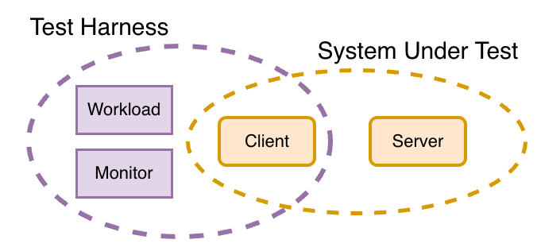
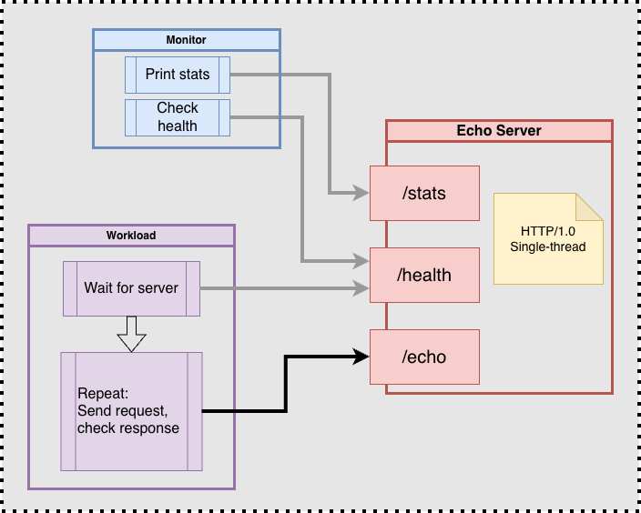
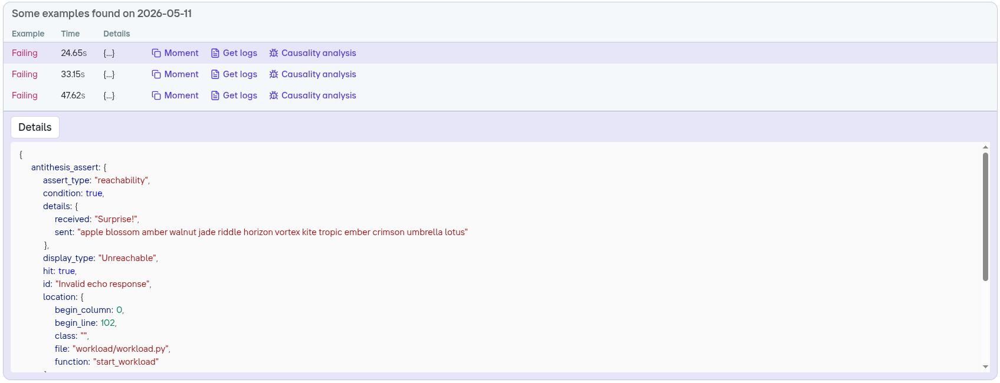
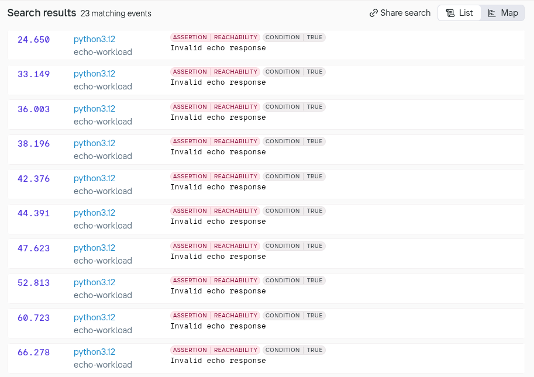
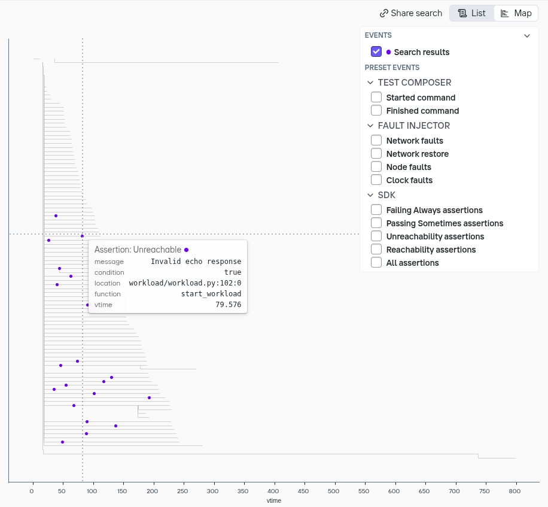
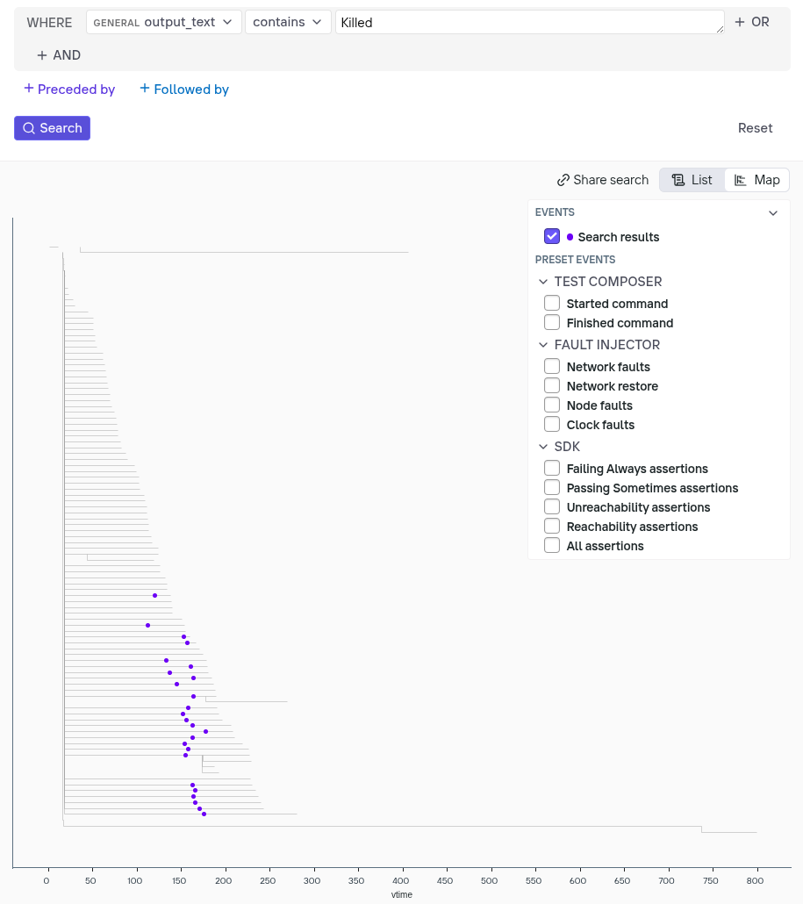

# Antithesis Guided Walkthrough: First Bug Hunt

This tutorial will guide you through your first mission to find and neutralize bugs with Antithesis.

This project contains a simple system, fully set up for Antithesis.
You will:
 - Run the project's unit-tests, then run the system locally with a workload
 - Explore an Antithesis test run to search for system misbehavior
 - Investigate bugs using the Antithesis [Triage Report](https://antithesis.com/docs/reports/) and [Logs Explorer](https://antithesis.com/docs/logs_explorer/)
 - Explore a second Antithesis test verifying fixes to the bugs

Happy bug hunting!

---

## Requirements

Running the local portions of this tutorial requires:
 - **Python (3.9+)** if you want to run tests locally
 - **Docker** or **Podman** if you want to run the entire system locally

 **No Docker or Python? No problem**. Just skip the local testing steps.
 
#### Environment setup

The python project has a few dependencies (such as the `requests` library).
From the `python` directory, run `make venv_setup` and follow the instructions to create and activate a local virtual environment. Run `make venv_check` to verify it.

You can sanity-check your Docker setup with `make check`.
If using Podman, update the corresponding variable in `Makefile`.

---

## Meet the SUT

SUT stands for 'System Under Test'; it is whatever you are putting under the microscope in Antithesis.

In this case, the SUT consists of a Python HTTP server that implements an "echo" service: 
an endpoint that responds to POST requests by sending back exactly the same bytes as the request body.

```python
  # Respond to echo requests by sending back the request body verbatim
 def on_echo_request(request) {
    request.send_response(200, request.body)
  }
```

The service exposes two additional endpoints: `/health` (which returns 200/OK), and `/stats` (which exposes server runtime counters).

A client for this server is also provided; it is part of the SUT and will be put under test.

The image below shows how the SUT fits into the Antithesis testing framework.



The image below gives a more detailed overview of the SUT components: the workload uses the client to send `/echo` requests to the server, and the monitor periodically reports info from the `/health` and `/stats` endpoints on the server.



**Somewhere inside the client and server, there are two bugs**: one obvious, one lurking in the shadows.

### Bug #1: Wrong response

This bug is trivial, but it is planted as a placeholder for the insidious "one in a million" bugs that are very hard to discover, as they require some specific set of rare circumstances to manifest.

```python
def process_echo_request(self, request_body):
    # Artificial "One in a million" bug. {*}
    if random(1_000_000) == 0:
        return "Surprise!".encode("utf-8")
    # Correct response:
    return request_body
```

As we will see, standard testing overlooks this bug!

### Bug #2: ???

The second bug is hidden, as all good bugs are.

We encourage you not to go look for it just yet. Instead, try to find it by investigating the symptoms, as you would for a real bug.

### Bug #3: Server unavailable?

The third bug manifests as a client not being able to talk to the server.
It's not quite a bug, but rather a slight misconfiguration that could easily go unnoticed, until it creates problems that require burning a lot of time tracking down.

We encourage you not to go look for it just yet. Instead, try to find it by investigating the symptoms.

# Part 1 - Local tests

From the `python` directory, run `make test` to run all the tests for the `client` and `server` modules, plus an additional end-to-end test that uses the client to make 100 requests to the server.

These tests have a chance to uncover the planted bugs — especially Bug #1 — but they very likely will not!

In fact, we encourage you to run the e2e test in a loop, and see how long it takes to discover Bug #1:
```sh
time while make test-e2e; do echo PASS; done
```

Warning, it may take **hours** before bug #1 surfaces and makes the command above fail -- don't wait up!

---

# Part 2 - Workload

In order to test our client & server in Antithesis, all we need to do is:
 - Put them to work
 - Check that they are working correctly

For this, we use a **workload**. A workload is one or more pieces of code that:
 - Continuously exercises the system under test (client+server in this case)
 - Periodically validates that the system is running correctly and nothing bad has happened

In this case, the workload consists of an infinite loop sending requests using the client and checking for valid responses from the server.

We can also define properties that should always be true for our system and validate them in the workload:
1. Using the echo service via the client always produces a valid response if the request succeeds (correctness/safety)
2. The server should always be able to respond within 20 seconds (liveness)

The basic structure of the workload is something like this:

```python
while True:
  req = create_random_request()
  resp = client.echo(req)
  if req != resp
    antithesis.alert("Response mismatch!", details={req, resp})
```

The response mismatch checks the primary correctness (safety) property.

We add some additional checks to make the workload fault tolerant and to test for liveness.

### Fault tolerance

Antithesis allows us to test in the presence of faults - in this case
network delays and packet drops.  Some number of requests may fail,
and that's ok. Errors are counted and printed, but the workload keeps
running.

```python
  try:
    resp = client.echo(req)
  except Exception e:
    errors++
```

### Progress check (liveness)
Temporary service outages are ok, but we never want our server to become permanently unavailable, i.e. stop responding to *all* future requests.
For this reason, we keep track of the last successful request, and raise a flag if it's been too long since the last successful operation.

```python
  if now() - last_successful_request > alert_threshold:
    antithesis.alert("Server unavailable for over {alert_threshold} seconds")
```

### Progress statistics
Every few seconds, the workload prints the count of successful requests and errors. This is useful to keep track of what is happening without flooding the output with each and every request and response.

## Run the system locally

To try out the system (i.e., the workload running against the server) locally, execute: `make run`.

This will:
 - Build a Docker image (containing both server and workload)
 - Bring up a Docker Compose environment
 - Start the workload, which will keep running until stopped

The environment setup is declared in `python/antithesis/config/docker-compose.yaml`, take a quick look.

The most important services are `workload` and `server`. Each service runs in its own container.

Ignore the additional services for now. We'll come back to them later.

Notice how each service references an entry-point script like `start_server.sh` and `start_workload.sh`.
You can find those in `python/antithesis/`, feel free to take a look.

The output may look something like this:

```
echo-server     | Starting server at 0.0.0.0:4444
echo-monitor    | Starting monitor targeting echo-server:4444
echo-workload   | Starting workload targeting echo-server:4444
echo-server     | Echo server listening on http://0.0.0.0:4444
echo-workload   | Workload running against http://echo-server:4444
echo-monitor    | echo-server:4444 : up=3.1s requests=10200 (+0) responses=10200 (+0) total_data=605.9KiB (+0.0B)
echo-workload   | Success: 17754 Errors: 0 Invalid response: 0
echo-monitor    | echo-server:4444 : up=6.2s requests=21774 (+11574) responses=21774 (+11574) total_data=1.3MiB (+684.8KiB)
echo-monitor    | echo-server:4444 : up=9.2s requests=32532 (+10758) responses=32532 (+10758) total_data=1.9MiB (+639.4KiB)
echo-workload   | Success: 36111 Errors: 0 Invalid response: 0
echo-monitor    | echo-server:4444 : up=12.2s requests=43543 (+11011) responses=43543 (+11011) total_data=2.5MiB (+651.3KiB)
echo-workload   | Success: 53207 Errors: 0 Invalid response: 0
[...]
```

The `monitor` service polls the server's `/stats` endpoint and prints server metrics at regular intervals.

A very large number of requests will be served. The network is local and the service is fast. You may even spot the occasional error due to Bug #1 if you leave this running long enough.

---

# Project structure, important files and concepts


### Build images and launch test run

This repository contains an example of a GitHub workflow that could be
used to launch an Antithesis test run:
`.github/workflows/python_antithesis_experiment.yml`

The important steps are:

1. Build and publish a `config` image. This image tells Antithesis how to run your software. Its most important file is `docker-compose.yaml`. The Dockerfile for this image is located in `python/antithesis/Dockerfile`. It consists of an empty image where we copy `docker-compose.yaml` along with an `environment` file.

2. Build and publish a `sut` image ("System Under Test"). The image for this tutorial is based on Ubuntu and includes all the files to run the server, workload/client, and the other services listed in the docker-compose file.
The Dockerfile for this image is in `python/Dockerfile`.

3. After images are built and published, we tell Antithesis to launch a new test run by hitting a specific web endpoint. The request body will look something like this:
```
{
  "params": {
    "antithesis.duration": "30",
    "antithesis.config_image": "python-echo-server-config:16_abfa9df464812b180a4c2f7d48026fe6b28d7c6a",
    "antithesis.description": "My first experiment",
    "antithesis.report.recipients": "my.name@example.com"
  }
}
```

Notice how it references the `config` image we just published, as well as specifying duration and notification address.

The script that makes this request can be found in `python/antithesis/scripts/launch_experiment.sh`

### SUT image
See: `python/Dockerfile`

In this case we are building a single image that contains `server`, `workload`, `monitor` and more. But as you can see from `docker-compose.yaml` each service uses a different entry-point to play a different role.

### Docker Compose
See: `python/antithesis/config/docker-compose.yaml`

The docker-compose file defines the services, networks, and any related configurations needed.
You can read more on the Docker best practices for testing in Antithesis [in our docs](https://antithesis.com/docs/best_practices/docker_best_practices/).

## Additional containers

There are two more services defined in `docker-compose.yaml` that we have not addressed yet.

### Service: `pause-faults`

Antithesis introduces all sorts of mayhem into the environment in order to push the system to hard-to-reach states and find interesting bugs.

With default settings, the faults are *unbound*, i.e. the fault injector can do anything it pleases. In order to test for liveness and recovery, we want faults to be *bound* (i.e. limited to some specific intervals).

This container runs a script that turns the fault injector on and off at random intervals.

The simplified logic is:
```sh
while true do
  random_on = random MIN_ON MAX_ON
  # Faults ON for $random_on seconds
  sleep ${random_on}

  random_off = random MIN_OFF MAX_OFF
  # Faults OFF for $random_off seconds
  pause_faults ${random_off}
  sleep ${random_off}
done
```

### Service: `monitor`

This service polls and prints server statistics (`/stats` server endpoint).

It is often a good idea to observe the system and the workload from an outside perspective, to make sure they are not stuck and to report high-level progress without excessive logging.

---

# Part 3 - First Antithesis test run

Now, let's observe what happens when we run the same system in
Antithesis. Here is a link to a report produced from a 30-minute test run: 
https://public.antithesis.com/report/TkY1zmjdGkicsYUS5JAaJGDP/mY8lMDnKzj765o26nvgXf3UaI9aIbRz0ehk5pv1BNfo.html

Let's look at the main sections.

### Environment
These are the images used.

### Utilization

Notice that we ran **24 hours** of testing in just **30 minutes**!


For languages that have Antithesis coverage instrumentation available (such as Rust, Go, or C++), this section will show a graph of "new behaviors" discovered. Behavior is a metric akin to code coverage, but applied to the entire system state-space.

In this case, there is no graph because Python instrumentation is not yet supported in Antithesis.

### Findings

Findings allow you to compare today's bugs to yesterday's. Let's
ignore this for now.

### Properties

Feel free to explore the passing properties.

When you're ready to hunt for bugs, switch the filter to `Failed` and expand all properties that require attention.

#### `Invalid echo response`

Let's start from known Bug #1. This property is telling us that the workload (client) sometimes receives an invalid response from the server.

The property we are checking is: **the echo endpoint always sends back the request body when responding successfully**.

In the workload we encode this property as an `unreachable` when the response does not match the sent message:

```python
# Request was successful
[...]
# Check response
if response == message:
    [...] # All is well
else:
    print(f"Invalid response! Sent '{message!r}', Received '{response!r}'")
    [...]
    details = {
        "sent": message,
        "received": response,
    }
    unreachable("Invalid echo response", details)
```

Antithesis gives us a few examples of this property failing, along with the `details` for each.



For each example, we can also see the logs leading up to that particular moment by clicking on the `Get logs` button.

Expand one of the examples:

```
(Assertion: Unreachable)
message: "Invalid echo response",
  file: workload/workload.py,
  line: 64,
  function: start_workload
  details: {
    sent: ivory violet kite iris spark
    received: Surprise!,
  }
```

In this case, it's clear what is happening: **Antithesis found our "one in a million bug" a couple dozen times within 30 minutes!** That's because it squeezed 24 hours of testing time into a half-hour.


#### `Unexpected server restart`

In this setup, we expect the server to keep running in perpetuity.

To detect an unexpected server crash-restart, the `monitor` service keeps tabs on the server uptime returned by the `/stats` endpoint. If the latter gets reset, the monitor flags this as an unexpected event.

The property we are implicitly checking is: **Server uptime grows monotonically**. We encode this property as an `unreachable` assertion in the monitor:

```python
if self.current_stats['uptime_seconds'] < self.previous_stats['uptime_seconds']:
    [...]
    details = {
        "previous_uptime": self.previous_stats['uptime_seconds'],
        "current_uptime": self.current_stats['uptime_seconds'],
    }
    unreachable("Unexpected server restart", details)
```

Server restarts are unexpected, so let's take a look at the logs for one of the examples by clicking the 'Get logs' button.

This opens the logs for a timeline leading up to that property being violated.

To reduce noise, let's filter out everything except for the server logs.

> ▽ (filter) > Container > `echo-server` > Only

It may show something like this:

```
13.821 Loading virtual environment...
13.822 Starting server
13.822 Bind address: 0.0.0.0:4444
13.875 Echo server listening on http://0.0.0.0:4444
112.033 Server exited with code 137
112.033 /app/start_server.sh: line 31:  23 Killed  python3 -u -m src.server --host ${BIND_ADDRESS} --port ${BIND_PORT_NUMBER} ${VERBOSE}
112.103 Loading virtual environment...
112.103 Starting server
112.103 Bind address: 0.0.0.0:4444
112.114 Echo server listening on http://0.0.0.0:4444
```

About 2 minutes into this timeline, the server gets killed by a `SIGKILL`. Interesting!

The good news is that it restarts almost immediately without issues.

Let's move on to the other properties for now, we'll come back to investigate this later.

#### `Server unavailable for too long (workload requests)`
This is telling us that the `workload` is unable to get a response from the server for 15 consecutive seconds (this alert threshold is configured in `docker-compose.yaml`: `ALERT_INTERVAL=15`).

Click on the logs for one of the examples and filter to just `workload`:

> ▽ (filter) > Source > `echo-workload` > Only

You may see something like this:

```
[...]
74.430 Success: 164793 Errors: 0 Invalid response: 1
79.430 Success: 178711 Errors: 2 Invalid response: 1
84.430 Success: 178711 Errors: 7 Invalid response: 1
89.430 Success: 178711 Errors: 9 Invalid response: 1
93.430 Success: 178711 Errors: 14 Invalid response: 1
97.430 Success: 178711 Errors: 19 Invalid response: 1
98.068 WARNING: 20.0s since the last successful request
```

Notice the number of successful requests is flat, while errors are going up at about 1 per second.

The server does indeed seem to be unreachable or unresponsive for an extended period of time!

This seems like a legitimate problem.
We'll come back to it later.

#### `Server unavailable for too long (monitor health-check)`
This is similar to failed property above, except it is raised by `monitor` when failing to poll the `health` endpoint for 15 seconds straight (the threshold for this alert is set in `docker-compose.yaml`: `HEALTH_ALERT_INTERVAL=15`).

Click on the logs for one of the examples and filter to `monitor`:

> ▽ (filter) > Source > `echo-monitor` > Only

You may see something like this:

```
[...]
20.653 Health check failed: timed out
25.654 Health check failed: timed out
30.682 Health check failed: timed out
39.982 Health check failed: timed out
39.982 WARNING: 20.7s since last successful health-check
```

Another issue confirmed. This and the previous one look similar in symptoms, despite coming from two different client processes and targeting different endpoints. Interesting...

---

# Part 5 -- Diagnose and fix the bugs

So far we have confirmed that the property failures in the report are genuine problems by looking at the logs for some of the examples.

Now let's investigate, find the bugs and see how we might fix them!

Once you're ready, hit the `Explore logs` button at the top of the report. This will take you to the **Logs Explorer**.

The [Logs Explorer](https://antithesis.com/docs/logs_explorer/) allows us to search for log messages and events (like property failures) across all the branches of the [multiverse](https://antithesis.com/docs/multiverse_debugging/moment_branch/) explored by Antithesis in this run.

## Bug #1 - Invalid response

This bug is planted intentionally, and we understand how it manifests.

Run the following search over assertions:

 > `message` > `contains` > `Invalid echo response`


⚠️ **Note:** Hitting Enter seems to clear the search field — in reality it adds a newline. Use Ctrl+Enter to search instead, or click the search button.

A list of examples will start rolling in.

Remember how multiple hours of local testing could not find Bug #1?

In 30 minutes, Antithesis found this bug dozens of times!
That's because the system was under test for the equivalent of 24 hours, compressed into 30 minutes.



Now switch to **Map** view to see the search results plotted over different timelines.



Click on any of the blue dots to load the logs for that timeline up to that moment.

This bug is pretty cheeky.  To fix it, we would just need to delete
the 4 lines of code that introduce it (in the `process_echo_request`
function in `server.py`).

```diff
def process_echo_request(self, request_body):
-    # Artificial "One in a million" bug. {*}
-    with open("/dev/urandom", "rb") as f:
-        r = int.from_bytes(f.read(4), "big")
-        if r % 1_000_000 == 0:
-            return "Surprise!".encode('utf-8')
```

## Bug #2 - Server crash

Earlier we confirmed that the server sometimes restarts unexpectedly, with exit code 137.

A couple of things to keep in mind:

- The server is single-threaded. So we can rule out issues related to concurrency.
- By default, Antithesis will not kill containers. That can be enabled, but it's off in this case. Antithesis is only introducing network faults.
- The server is (mostly) stateless. The only state is a list of the last 15 requests received, kept around for debugging in case of an unhandled exception.

With that in mind, let's explore logs to see if we can spot some patterns that can lead us to the bug.

#### Q: Is there a pattern in the crashes?

Run the following search in the Logs Explorer:

 > `output_text` > `contains` > `Killed`



Interestingly, server kill events are not uniformly distributed over time. They tend to cluster between t=100 and t=160. This could be a clue.

The crashes seem to always happen after a certain amount of time (or maybe it's number of requests processed?)

#### Hypothesis: Memory leak / OOM

An exit code of 137 indicates the server was killed with a SIGKILL. One common reason for this to happen is that the process is out of memory.

We said earlier the server is *mostly* stateless. In truth, it does retain some state: a list of the last 15 requests received (see: `EchoHandler::MAX_RECENT_REQUESTS`).

We append to this list in `save_request` and then trim it — or do we?

```python
    def save_request(request_body):
        # Save the last request, useful for debugging in case of crash
        EchoHandler.RECENT_REQUESTS.append(request_body)
        # Only retain the most recent MAX_RECENT_REQUESTS requests
        if len(EchoHandler.RECENT_REQUESTS) > EchoHandler.MAX_RECENT_REQUESTS:
            EchoHandler.RECENT_REQUESTS[-EchoHandler.MAX_RECENT_REQUESTS:] # {*}
```

D'oh! We are taking a slice, but not re-assigning it. The `RECENT_REQUESTS` list will grow without bound until the server runs out of memory and gets OOM-killed.

We could fix this by assigning the slice:

```diff
-            EchoHandler.RECENT_REQUESTS[-EchoHandler.MAX_RECENT_REQUESTS:]
+            EchoHandler.RECENT_REQUESTS = EchoHandler.RECENT_REQUESTS[-EchoHandler.MAX_RECENT_REQUESTS:]
```

## Bug #3 - Server unavailable for too long

The following property failures are telling us that the server is unreachable for periods over 15 seconds:

 * `Server unavailable for too long (workload requests)`
 * `Server unavailable for too long (monitor health-check)`

How long is "too long" is a parameter configured in `docker-compose.yaml`:

```
  echo-monitor:
    environment:
      - HEALTH_ALERT_INTERVAL=15

  [...]

  echo-workload:
    environment:
      - ALERT_INTERVAL=15
```

#### Q: Does the server take a long time to restart after a crash?

We know the server sometimes crashes, but logs show that it gets restarted and comes back online very quickly (in milliseconds).

```
147.233 [echo-server] /app/start_server.sh: line 31:    23 Killed
147.233 [echo-server]  Server exited with code 137
(...)
147.314 [echo-server] Echo server listening on http://0.0.0.0:4444
```

#### Q: Is the fault injector too aggressive?

The `pause-fault` service in `docker-compose.yaml` controls the fault injector and alternates periods of chaos and quiet.

```
  pause-faults:
    environment:
      - MIN_ON=5
      - MAX_ON=10
```

Periods of fault only last between 5 and 10 seconds. So this does not explain 15 seconds of unavailability.

#### Property failures log examples
Let's look at a few examples of property failures using the following query (which matches failures of both properties above):

 > `Assertion status` > `Failing`
 > `AND`
 > `Assertion message` > `contains` > `Server unavailable for too long`

Let's look at one example of a `workload` container's log:

```
105.026 Success: 311213 Errors: 0 Invalid response: 0
(...)
108.159 [Server crash and restart]
(...)
128.188 Request failed: Max retries exceeded with url: /echo (Connection to echo-server timed out. (connect timeout=20))
129.188 WARNING: 21.0s since the last successful request
```

This is interesting! When the server crashes, a pending request takes 20 seconds to time-out. And this triggers our "No successful request for >15s" property.

Notice how we experimentally discovered a client value (20s timeout)
that could have easily go overlooked. In large systems, hundreds such
magic values are present, and their side effects can be hard to grasp.
Fortunately, Antithesis is great at finding examples where these
values play a role, forcing us to give them more consideration.

In this case we have two options:
 - If a 20s timeout on requests is appropriate, then we should relax the property threshold, say from 15s to 25s.
 - If a 20s timeout is just a default we didn't think too hard about, then we may consider lowering it.

Let's proceed presuming we elect for the latter. The server should
respond very quickly to any request, so a lower timeout on socket
connection and read seems appropriate

```diff
--- a/python/src/client/client.py
+++ b/python/src/client/client.py
@@ -1,6 +1,6 @@
-DEFAULT_TIMEOUT=(20, 20) # Connect and read timeouts # {*}
+DEFAULT_TIMEOUT=(3, 3) # Connect and read timeouts # {*}
```

---

# Part 6 - Second Test Run

After making these changes, a second report of the same length should
come back with some issues resolved:
https://public.antithesis.com/report/Gq9IIsxCu_Px0TmheaecN-CV/s1lkJhqQe_dEDfiyZbIjlggYX3qiZLZz8cgVzWllnXM.html

# Conclusion

Antithesis gives us powerful tools to find and verify fixes for bugs.
In this walkthrough, we've seen some of these tools in action, and
given an example of a basic workflow for debugging a system.

There's a lot more we haven't covered here! If you think tooling like
this would be useful to you and your team, feel free to reach out!

---

# Disclosure

You may notice some obscure settings in `docker-compose.yaml`, they are there to make this experience a little more approachable.

#### Server memory limit: 50MB
The workload sends small requests (1-15 words from a dictionary) for readability, but we do want to see the server to get OOM-killed within a reasonable timeframe. For this reason, the server memory is capped to 50MB. It takes about 300k requests to crash it.

#### Workload and Monitor DNS Resolution
In the investigation of Bug #3 (server unavailable) we only found and fixed one possible reason. There is another cause that can lead to the same symptoms.
After a container crash, Podman DNS may take 10-20 seconds before re-registering the restarted server. During this time DNS does not resolve.

#### Use `/dev/urandom` for Bug #1
Due to the behavior of Python's RNG when running in a deterministic simulation, all branches explored would behave exactly the same. By pulling from `/dev/urandom` (which is controlled by Antithesis), we get a lot more varied exploration.
